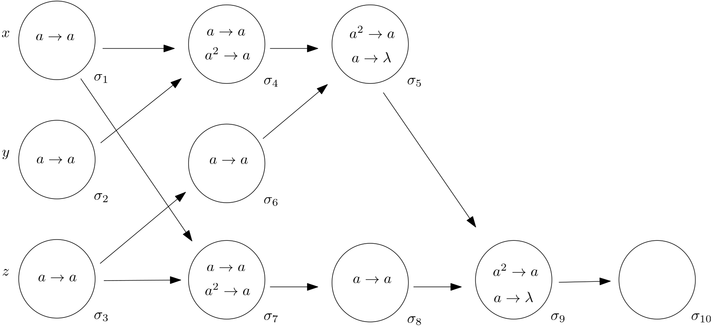

This document refers to the paper **“Spiking Neural P Systems and Kernel P Systems”** and the folder **[Examples/LogicalGate](Examples/LogicGate)**, which consists of four subfolders and the file **LogicalGateModelDiagram**. This diagram corresponds to Example 1 from the paper (Fig. 1 coincides with Diagram 1). Next, are described the folders and their contents associated with the three examples from the paper.

## Example 1

Example 1, depicted in the diagram, refers to a spiking neural P system (SN P system) with 10 neurons, computing the logical expression **((x ∨ y) ∧ z) ∧ (x ∨ z)**, where x, y, z are Boolean variables (1-true, 0-false). Their values will be inputted in the input neurons, as described in the paper.

  
  <br?

  *Diagram 1*

## [Examples/LogicalGate](Examples/LogicGate) Subfolders Description

- **[Models](Examples/LogicGate/Models)**: This folder contains the three examples that appear in the paper: the first two examples, as SN P systems, written in P-Lingua, under the subfolder P-Lingua; and all of them, as kP systems, written in kP-Lingua, under the subfolder kPL.  LogicalGate corresponds to example 1, LogicalGateDelay to Example 2 and LogicalGalePolarizatio to Example 3. For each of these models two executions are provided, as traces of execution, for inputs 0,1, 1 and 1, 1, 1 in the above mentioned subfolders.

- **[Traces](Examples/LogicGate/Traces)**: Contains traces of execution (running the kP systems corresponding to the SN P system represented in Fig. 1) for all possible input values of x, y, z (8 values, from 0,0,0 to 1,1,1). These are utised by the learning algorithm to infer the X-machine used for testing.

- **[Testing](Examples/LogicGate/Testing)**: Contains 4 files:
  - **_Rules**: The rule and list of combination of rules occurring in the computations for the above inputs; these will be labels of the functions of the X-machine.
  - **DFA_transition_table**: Transition table of the deterministic finite automaton obtained by using the learning algorithm with bounded sequences of length up to 4; the labels "a" to "s" correspond to combinations of rules applied.
  - **DFA Diagram**: The diagram corresponding to the transition table.
  - **Computed U set**: Test set with test sequences related to the SN P system model in Fig. 1, computed based on the DFA constructed (provided in the two files above).
  - **TestingMutants**: Contains test sequences applied in the case of errors, seeded in the implementation of the SN P system through mutations applied to rules.

- **[Verification](Examples/LogicGate/Verification)**: Contains 3 files:
  - **NuSMV Model**: The NuSMV model generated by kPWorkbench from the kP system built from the SN P system in Fig. 1.
  - **Properties**: The properties of the logical gate model in Table 5.
  - **Properties Verification Results**: The properties specified in LTL and CTL and their results
